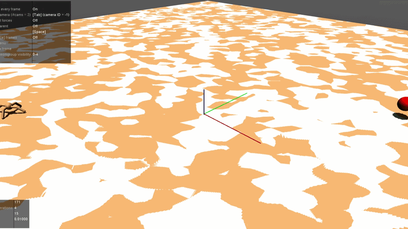
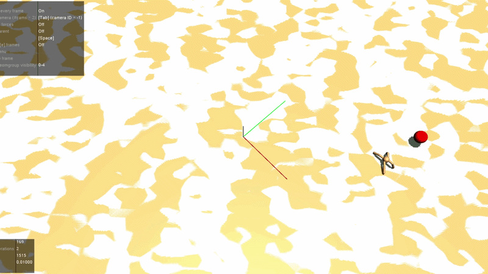

# Goal-Directed Ant Locomotion with PPO

Reinforcement learning for goal-directed locomotion using MuJoCo Ant with curriculum learning and reward shaping.

## Demo

<p align="center">
  
</p>
<p align="center">
  
</p>

## Overview
We train a PPO agent in a custom Ant environment to first learn stable locomotion and then navigate toward a target.  
The project focuses on reward design to achieve smooth and directed motion.

## Key Features
- Algorithm PPO
- Two-stage training (locomotion → navigation)
- Custom reward shaping for direction and stability
- Success rate ~90%

## Method

### Training Strategy
- Stage 1 Learn stable locomotion
- Stage 2 Fine-tune for goal-directed movement

### Reward Design
- Progress toward target
- Direction alignment
- Piecewise speed reward (alignment-based)
- Side drift penalty
- Action smoothness penalty

## Results
- Stable locomotion learned in stage 1
- ~80% success rate in reaching target
- Reduced oscillation and drifting
- More direct trajectories after reward tuning

## Environment
Custom Ant environment with
- Target-based navigation
- Direction-aware reward
- Termination for stuck  out-of-bound  fall

## Training
```bash
python train_ppo.py
